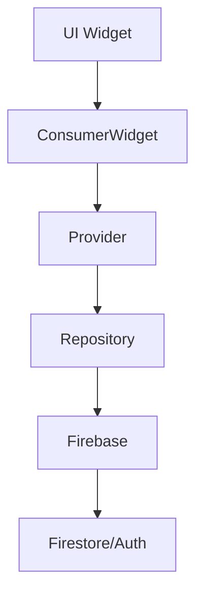
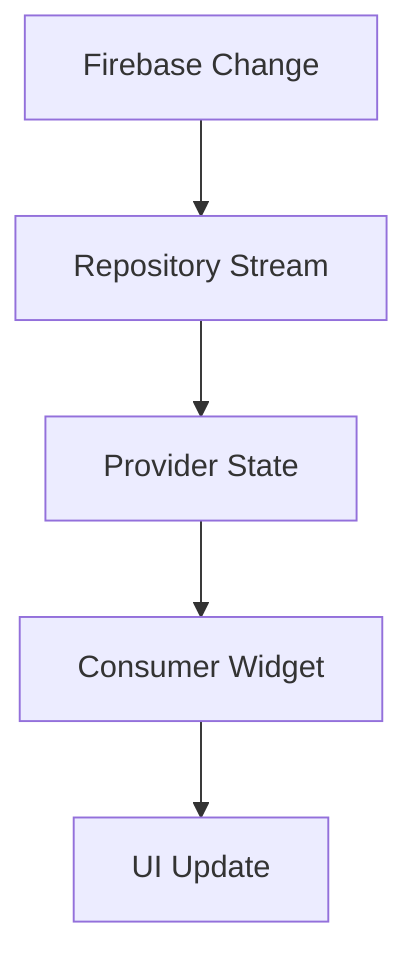
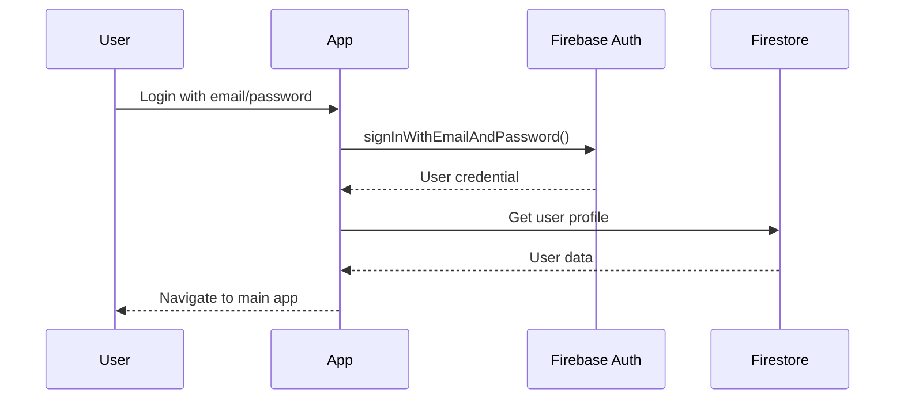

# 🏗 Architecture Documentation

## Project Architecture Overview

Pickle Connect follows **Clean Architecture** principles with a **Feature-First** approach, using **Riverpod** for state management and **Firebase** as the backend.

## 📁 Directory Structure

```
lib/
├── core/                    # Core app utilities and configuration
│   ├── theme/              # App theming (colors, typography, etc.)
│   └── utils/              # App routing and utilities
├── features/               # Feature modules (domain-driven design)
│   ├── auth/              # User authentication
│   ├── players/           # Player management and search
│   ├── matches/           # Match challenges and scoring
│   ├── ladder/            # Ladder rankings and seasons
│   ├── tournaments/       # Tournament system
│   ├── scheduling/        # Court booking and scheduling
│   └── profile/           # User profile management
├── shared/                # Shared components and services
│   ├── models/           # Data models (freezed classes)
│   ├── widgets/          # Reusable UI components
│   └── services/         # Shared services (notifications, etc.)
└── scripts/              # Database seeding and utility scripts
```

## 🎯 Feature Architecture

Each feature follows a consistent structure:

```
feature_name/
├── data/
│   └── repositories/      # Data access layer
├── domain/               # Business logic (optional)
│   ├── entities/        # Domain entities
│   └── usecases/        # Business use cases
└── presentation/
    ├── pages/           # UI screens
    ├── widgets/         # Feature-specific widgets
    └── providers/       # State management
```

## 🔄 Data Flow Architecture

### Request Flow


### State Updates


## 🏛 Core Architectural Patterns

### 1. Repository Pattern
Abstracts data access and provides a clean API for business logic.

```dart
abstract class UserRepository {
  Future<User?> getUser(String userId);
  Stream<List<User>> getAllActiveUsersStream();
  Future<void> createUser(User user);
}

class UserRepositoryImpl implements UserRepository {
  final FirebaseFirestore _firestore;
  
  @override
  Stream<List<User>> getAllActiveUsersStream() {
    return _firestore
        .collection('users')
        .where('isActive', isEqualTo: true)
        .snapshots()
        .map((snapshot) => snapshot.docs
            .map((doc) => User.fromJson(doc.data()))
            .toList());
  }
}
```

### 2. Provider Pattern (Riverpod)
Manages state and dependency injection.

```dart
// Repository provider
final userRepositoryProvider = Provider<UserRepository>((ref) {
  return UserRepositoryImpl(FirebaseFirestore.instance);
});

// Stream provider for real-time data
final playersProvider = StreamProvider<List<User>>((ref) {
  final repository = ref.watch(userRepositoryProvider);
  return repository.getAllActiveUsersStream();
});

// State notifier for complex state management
final matchProposalProvider = StateNotifierProvider<MatchProposalNotifier, MatchProposalState>(
  (ref) => MatchProposalNotifier(ref.watch(matchRepositoryProvider)),
);
```

### 3. Observer Pattern
Real-time updates using Firebase Streams and Riverpod.

```dart
class PlayersPage extends ConsumerWidget {
  @override
  Widget build(BuildContext context, WidgetRef ref) {
    final playersAsync = ref.watch(playersProvider);
    
    return playersAsync.when(
      data: (players) => ListView.builder(...),
      loading: () => CircularProgressIndicator(),
      error: (error, stack) => ErrorWidget(error),
    );
  }
}
```

## 🔒 Security Architecture

### Authentication Flow


### Data Security
- **Firestore Security Rules**: Control access to data
- **Environment Variables**: Sensitive keys in `.env`
- **Authentication State**: Global auth state management
- **Role-based Access**: Admin vs Player permissions

## 📱 UI Architecture

### Widget Hierarchy
```
MaterialApp
├── ProviderScope (Riverpod)
├── GoRouter (Navigation)
└── MainNavigation
    ├── AppBar (with logout)
    ├── Body (route content)
    └── BottomNavigationBar
```

### Theme Architecture
```dart
// Centralized theming
class AppTheme {
  static ThemeData get lightTheme => ThemeData(
    primarySwatch: Colors.green,
    // ... theme configuration
  );
}
```

### Navigation Architecture
```dart
// Declarative routing with GoRouter
final routerProvider = Provider<GoRouter>((ref) {
  return GoRouter(
    initialLocation: '/login',
    routes: [
      ShellRoute(
        builder: (context, state, child) => MainNavigation(child: child),
        routes: [
          GoRoute(path: '/players', builder: (context, state) => PlayersPage()),
          GoRoute(path: '/matches', builder: (context, state) => MatchesPage()),
        ],
      ),
    ],
  );
});
```

## 🗄 Database Architecture

### Firestore Collections Structure
```
/users/{userId}
├── id: string
├── email: string
├── fullName: string
├── skillDivision: string
├── ustaRating: string
└── isActive: boolean

/matches/{matchId}
├── id: string
├── player1Id: string
├── player2Id: string
├── status: string
├── scheduledAt: timestamp
└── result?: MatchResult

/seasons/{seasonId}
├── id: string
├── name: string
├── startDate: timestamp
├── endDate: timestamp
└── /entries/{playerId}
    ├── playerId: string
    ├── rank: number
    ├── wins: number
    └── losses: number
```

### Real-time Subscriptions
```dart
// Automatic UI updates with Firestore streams
Stream<List<Match>> getUserMatches(String userId) {
  return _firestore
      .collection('matches')
      .where('participants', arrayContains: userId)
      .snapshots()
      .map((snapshot) => snapshot.docs
          .map((doc) => Match.fromJson(doc.data()))
          .toList());
}
```

## 🔧 State Management Architecture

### Provider Types Used

1. **Provider**: Immutable dependencies
2. **StreamProvider**: Real-time data streams
3. **StateNotifierProvider**: Complex state management
4. **StateProvider**: Simple state values

### State Patterns
```dart
// Complex state with sealed classes
sealed class MatchProposalState {
  const MatchProposalState();
  const factory MatchProposalState.initial() = _Initial;
  const factory MatchProposalState.loading() = _Loading;
  const factory MatchProposalState.success() = _Success;
  const factory MatchProposalState.error(String message) = _Error;
}

// State notifier implementation
class MatchProposalNotifier extends StateNotifier<MatchProposalState> {
  MatchProposalNotifier(this._repository) : super(const MatchProposalState.initial());
  
  Future<void> createMatchProposal(...) async {
    state = const MatchProposalState.loading();
    try {
      await _repository.challengePlayer(...);
      state = const MatchProposalState.success();
    } catch (error) {
      state = MatchProposalState.error(error.toString());
    }
  }
}
```

## 🧪 Testing Architecture

### Testing Strategy
- **Unit Tests**: Business logic and repositories
- **Widget Tests**: UI components and pages
- **Integration Tests**: End-to-end user flows

### Test Structure
```dart
// Repository tests
void main() {
  group('UserRepository', () {
    late MockFirebaseFirestore mockFirestore;
    late UserRepository repository;
    
    setUp(() {
      mockFirestore = MockFirebaseFirestore();
      repository = UserRepositoryImpl(mockFirestore);
    });
    
    test('should return user when found', () async {
      // Test implementation
    });
  });
}
```

## 📊 Performance Architecture

### Optimization Strategies
1. **Real-time Data**: Only subscribe to necessary data
2. **Pagination**: Limit query results for large datasets
3. **Caching**: Riverpod automatic caching
4. **Code Generation**: Freezed for efficient data models

### Memory Management
```dart
// Automatic disposal with Riverpod
final provider = StreamProvider.autoDispose<List<User>>((ref) {
  return repository.getUsersStream();
});
```

## 🚀 Deployment Architecture

### Build Process
1. Environment configuration (`.env`)
2. Code generation (`build_runner`)
3. Testing and analysis
4. Platform-specific builds (iOS/Android)

### CI/CD Considerations
- Automated testing on PR
- Environment-specific builds
- Firestore security rule deployment
- App store deployment pipelines

This architecture provides a scalable, maintainable foundation for the tennis club management application with clear separation of concerns and real-time capabilities.